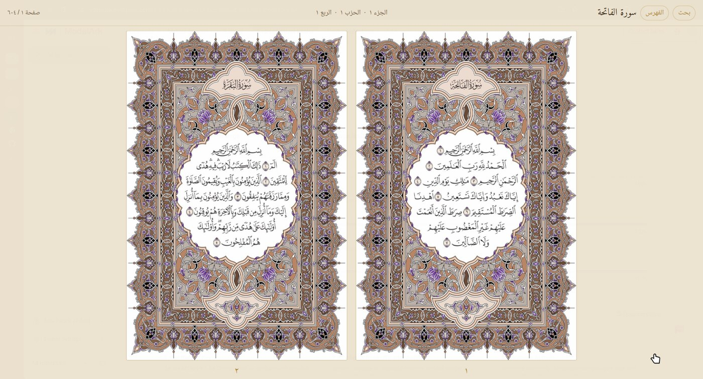
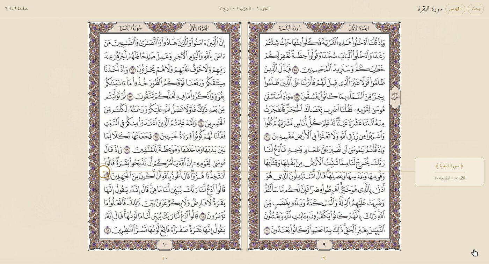
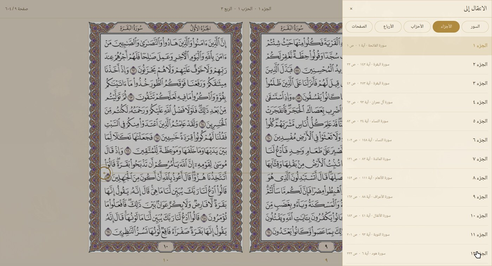
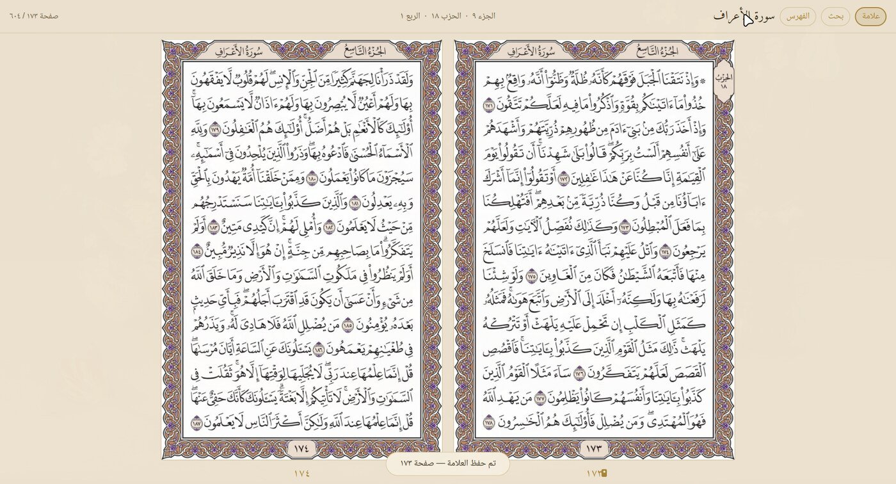
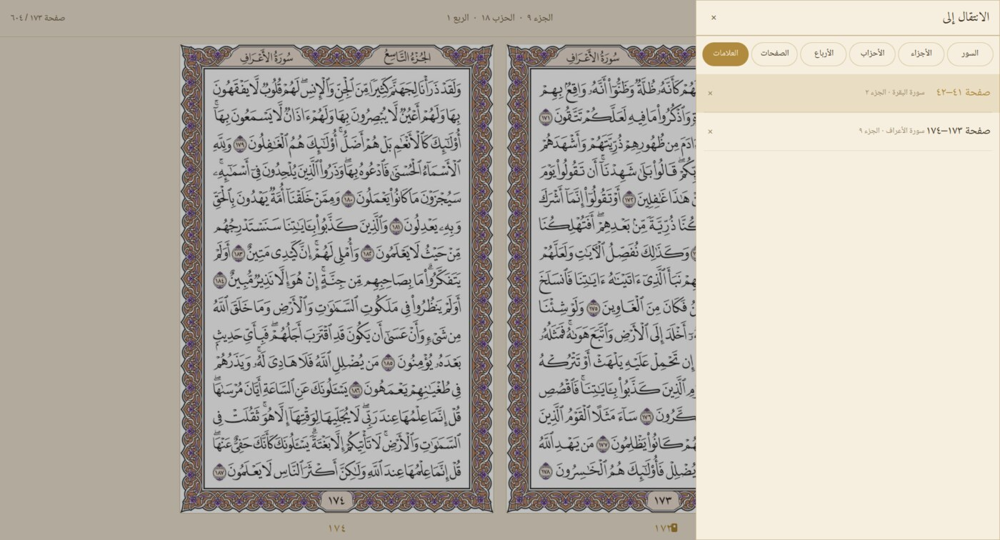

<div dir="rtl" align="right">

# القرآن الكريم — قارئ ومصحف المدينة النبوية للينكس

**قارئ قرآن كامل لسطح مكتب لينكس (Wayland / Hyprland / Quickshell)** — يعرض **٦٠٤ صفحة من طبعة مصحف المدينة النبوية الرسمية** بالرسم العثماني، صفحتين متجاورتين كما في المصحف المطبوع، مع بحث عربي ذكي، فهرس كامل (سور · أجزاء · أحزاب · أرباع · صفحات)، وعلامات حفظ لمواضع التوقف.

مصحف · قرآن · قارئ قرآن · مصحف المدينة · الرسم العثماني · تطبيق قرآن للينكس · بحث في القرآن · القرآن الكريم كامل

Quran reader for Linux · Madinah Mushaf · Uthmani script · Quickshell / QML desktop app



</div>

<div dir="rtl" align="right">

## المزايا

- **نفس المصحف بالضبط**: ٦٠٤ صفحة من طبعة مصحف المدينة النبوية (مجمع الملك فهد — مصحف حفص) بإطارها المزخرف، وترقيم الصفحات مطابق للمطبوع (الفاتحة ص١، البقرة ص٢، آية الكرسي ص٤٢، الناس ص٦٠٤ — تم التحقق آية بآية).
- **صفحتان متجاورتان** مثل المصحف المفتوح: الفردية يمينًا والزوجية يسارًا، مع أرقام الصفحات.
- **شريط معلومات حي**: السورة والجزء والحزب والربع والصفحة الحالية، يتحدث لحظيًا مع كل تقليب.
- **بحث عربي**: اكتب أي كلمة من القرآن (بدون تشكيل)، اسم سورة، حرفًا، أو رقم صفحة — ثم اختر النتيجة فينقلك مباشرة إلى الصفحة ويضع علامة ذهبية على موضع الآية نفسها، مع معالجة كاملة للتشكيل (ة/ه، أ/ا، ى/ي...).
- **فهرس كامل** بتبويبات (Ctrl+G): السور (١١٤) · الأجزاء (٣٠) · الأحزاب (٦٠) · الأرباع (٢٤٠) · الصفحات (٦٠٤) · علامات الحفظ — يفتح دائمًا على موضع قراءتك الحالي.
- **علامات الحفظ**: علّم أي صفحة أو آية بزر «علامة» أو `Ctrl+B` — تظهر شريطة ذهبية على الصفحة، وتُحفظ في تبويب العلامات للرجوع إليها أو حذفها في أي وقت.
- **تقليب سهل**: انقر على يمين أو يسار الشاشة، الأسهم، عجلة الفأرة، أو المسافة — مع تلميحات شبه شفافة تظهر عند مرور المؤشر.
- **يستعيد آخر صفحة** تلقائيًا عند إعادة الفتح.
- **خفيف وأصلي**: مبني بـ Quickshell و QML (Qt 6) — بدون متصفح أو Electron، سريع الاستجابة ومتناسق مع Hyprland.

## لقطات الشاشة

| البحث مع علامة الآية | فهرس الأجزاء والأرباع |
|---|---|
|  |  |

| علامة الحفظ | قائمة العلامات |
|---|---|
|  |  |

## التركيب

المتطلبات: لينكس بواجهة Wayland (نوصي Hyprland)، وحزمة [Quickshell](https://quickshell.org) ‏0.3+ و Qt 6.6+.

```bash
# 1) استنساخ المستودع
git clone https://github.com/karem505/alquran.git
cd alquran

# 2) تنزيل صفحات المصحف (٦٠٤ صفحة، ~١٧٠ ميجابايت — مرة واحدة)
tools/fetch-pages.sh

# 3) إنشاء اختصار التطبيق في قائمة البرامج (اختياري)
tools/install-desktop.sh

# 4) التشغيل
qs -p "$PWD/shell.qml"
```

على Arch: `sudo pacman -S quickshell qt6-declarative` ثم اتبع الخطوات أعلاه. وبعد التثبيت ستجد التطبيق باسم **«القرآن الكريم»** في قائمة البرامج.

## اختصارات المفاتيح

- `Ctrl+F` — البحث في القرآن
- `Ctrl+G` — الفهرس (سور / أجزاء / أحزاب / أرباع / صفحات / علامات)
- `Ctrl+B` — حفظ / إزالة علامة موضع القراءة الحالي
- `F11` — ملء الشاشة · `Esc` — إغلاق النوافذ المنبثقة
- الأسهم أو مسافة — تقليب الصفحات · `Home` / `End` — أول المصحف / آخره
- وداخل الفهرس: الأرقام `١`–`٦` أو الأسهم للتنقل بين التبويبات

## البيانات والمصادر

- **صور الصفحات**: طبعة مصحف المدينة النبوية الرسمية (مجمع الملك فهد لطباعة المصحف الشريف) — حقوق الطبعة محفوظة للمجمع، وتُستخدم هنا للعرض الشخصي غير التجاري. تُنزَّل عبر `tools/fetch-pages.sh` من [QuranHub/quran-pages-images](https://github.com/QuranHub/quran-pages-images) (غير مُضمَّنة في المستودع).
- **النص العثماني**: [Tanzil.net](https://tanzil.net) (نص مصحف المدينة).
- **ترقيم الصفحات والجزء/الحزب/الربع**: بيانات [AlQuran Cloud](https://alquran.cloud) وموسوعة القرآن المفتوحة (QUL).
- **إحداثيات الآيات على الصفحات**: مستودع QuranHub (quran-pages-images).

جميع البيانات المُشتقَّة الجاهزة موجودة في مجلد `data/`، والسكربتات في `tools/`.

## التقنيات

Quickshell · QML (Qt 6) · Wayland / Hyprland — تطبيق مكتبي أصلي بلا متصفح، بواجهة عربية RTL كاملة وخطوط مصحفية.

## الترخيص

الكود: [MIT](LICENSE). الصور والبيانات: وفق شروط مصادرها المذكورة أعلاه.

</div>
